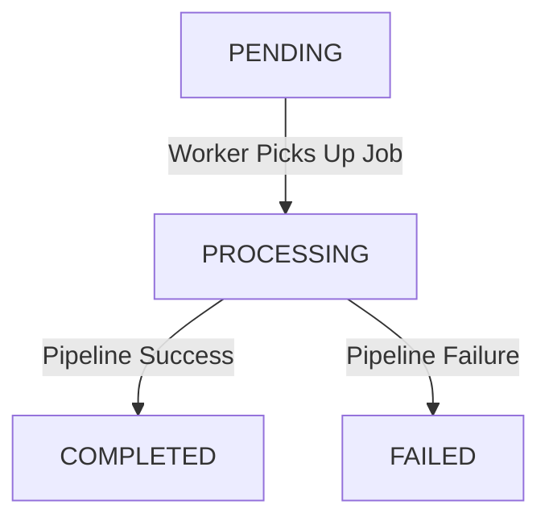

# AI Processing Worker Queue & Event API Documentation

The AI Processing Worker is a background processing microservice that processes images asynchronously. Since it does not expose an HTTP REST interface, this document defines the asynchronous message-passing interface (queues), payload formats, state transitions, database side effects, and downstream events.

## Queue Context

*   **Redis Connection Host:** Shared Redis instance configured via environment variables.
*   **Database Engine:** PostgreSQL via Prisma (shared database schema).
*   **Task/Queue Processor:** BullMQ (Node.js/TypeScript queue library).

---

## 1. Input Queue: `image-processing`

The worker listens on the `image-processing` BullMQ queue for incoming image-processing tasks.

*   **Queue Name:** `image-processing`
*   **Job Name:** Custom or default BullMQ job name (e.g., `image-process-job`).
*   **Payload Format (JSON):**
    ```json
    {
      "jobId": "db-job-uuid-here",
      "userId": "db-user-uuid-here",
      "fileKey": "r2-storage-file-key-here"
    }
    ```
    *Note: `jobId` and `userId` must exist in the database, and `fileKey` must point to a valid uploaded image in the Cloudflare R2 bucket.*

### State Transitions (PostgreSQL `Job` Status)

During execution, the worker mutates the status of the job in PostgreSQL:



*   **PROCESSING State Update:** Immediately after dequeueing, the job's status changes to `PROCESSING`.
*   **COMPLETED State Update:** Upon success, a `Result` record is created, and the job status is set to `COMPLETED`.
*   **FAILED State Update:** If any step fails, the status is set to `FAILED`, and the `error` column in the database is updated with the error details.

---

## 2. AI Processing Pipeline

When a job is processed, the worker executes the following sequential pipeline:

| Step | Service | API/Provider | Description |
| :--- | :--- | :--- | :--- |
| **1. Storage** | `StorageService` | Cloudflare R2 | Downloads the raw image buffer using the provided `fileKey`. |
| **2. Captioning** | `CaptioningService` | Hugging Face (Salesforce/blip-image-captioning-base) | Generates a textual description/caption of the image content. |
| **3. Tagging** | `VisionLabelService` | Google Cloud Vision API | Detects prominent visual labels/tags within the image. |
| **4. Moderation** | `SafetyService` | Google Cloud Vision API | Screens the image for adult, violent, racy, medical, or spoofed content. |

---

## 3. Database Side-Effects (PostgreSQL via Prisma)

Upon completion, the worker persists the processed metadata into the `Result` model, linked to the `Job` model.

### Saved Result Payload Schema

```json
{
  "id": "result-uuid-here",
  "jobId": "job-uuid-here",
  "caption": "A beautiful sunset over the mountains",
  "labels": ["Sunset", "Sky", "Mountain", "Nature"],
  "flagged": false,
  "flaggedCategory": null,
  "createdAt": "2026-06-17T05:00:00.000Z",
  "updatedAt": "2026-06-17T05:00:00.000Z"
}
```

*   If the image is flagged by the moderation step, `flagged` will be `true`, and `flaggedCategory` will contain the safety category (e.g., `adult`).

---

## 4. Output Queue: `notifications`

After processing is finished, the worker publishes a job to the downstream `notifications` queue to notify the user.

*   **Queue Name:** `notifications`
*   **Job Name:** `send-notification`
*   **Attempts & Backoff:**
    *   `attempts`: 3
    *   `backoff`: Exponential, 1000ms delay

Depending on the safety evaluation, one of the two event types is dispatched:

### Case A: Image Processed Successfully (Safe)

Sent when the image passes all safety checks.

*   **Payload Format (JSON):**
    ```json
    {
      "type": "IMAGE_PROCESSED_SUCCESS",
      "userId": "db-user-uuid-here",
      "jobId": "db-job-uuid-here"
    }
    ```

### Case B: Adult Content Flagged (Unsafe)

Sent when safety checks flag the image as unsafe.

*   **Payload Format (JSON):**
    ```json
    {
      "type": "ADULT_CONTENT_FLAGGED",
      "userId": "db-user-uuid-here",
      "jobId": "db-job-uuid-here",
      "category": "adult"
    }
    ```

---

## Error Handling & Resiliency

| Failure Scenario | Recovery Mechanism | Database Effect |
| :--- | :--- | :--- |
| **Third-Party API Downtime** | BullMQ retry mechanism will rerun the job (up to queue-configured limits). | Job remains in `PROCESSING` or moves to `FAILED` with retry logs. |
| **Non-Retryable Errors (e.g., Missing File)** | Job is immediately marked as `FAILED` without retrying. | `status` updated to `FAILED`, and error message written to database `error` field. |
| **Redis/Database Disconnection** | The worker process will log the exception and temporarily block processing until connection is re-established. | No updates until connection is recovered. |
