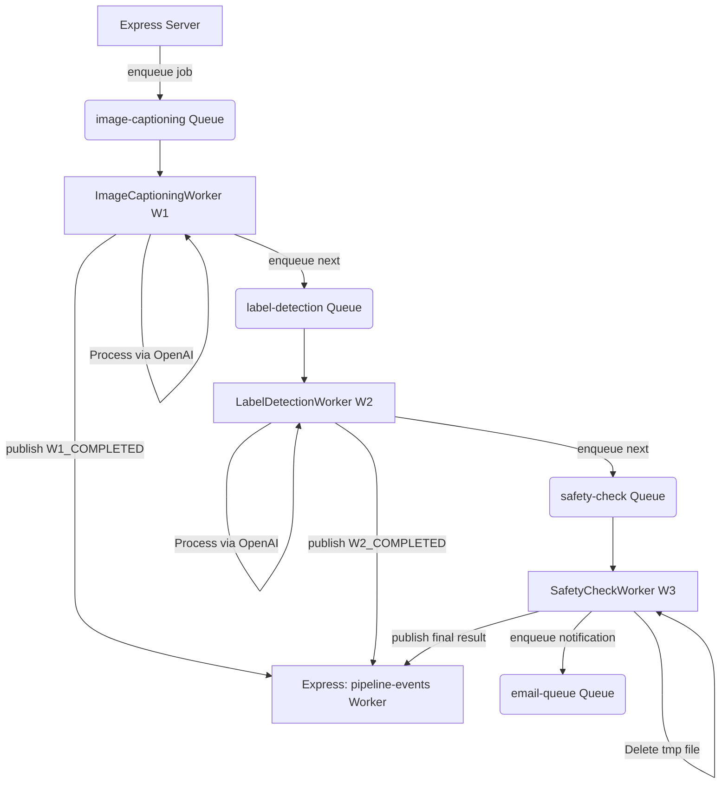

# AI Processing Worker Microservice

This is a standalone, database-free microservice responsible for processing multi-stage image pipelines asynchronously using BullMQ and **OpenAI's GPT-4o-mini Vision API**.

---

## Architecture & Coordination

Instead of running a single monolithic job, the AI pipeline is split into three decoupled queue workers that process jobs sequentially using the OpenAI API:

1. **`image-captioning` queue**:
   - Consumed by **`ImageCaptioningWorker`**.
   - Downloads the image buffer from Cloudflare R2 and writes it to a local temporary cache file (`/tmp/pipeline-job-{jobId}.tmp`).
   - **Stage 1: Image Captioning**: Sends the image to OpenAI Vision API with a prompt to generate a descriptive caption.
   - Publishes a `W1_COMPLETED` event back to Express Server and enqueues to the next stage.
2. **`label-detection` queue**:
   - Consumed by **`LabelDetectionWorker`**.
   - Reads the image buffer from the local cache file (falls back to downloading from R2 if missing).
   - **Stage 2: Label Detection**: Sends the image to OpenAI Vision API requesting a comma-separated list of relevant labels.
   - Publishes a `W2_COMPLETED` event and enqueues to the final stage.
3. **`safety-check` queue**:
   - Consumed by **`SafetyCheckWorker`**.
   - Reads the cached image buffer.
   - **Stage 3: Content Safety Moderation**: Sends the image to OpenAI Vision API asking if the content violates safety policies (returns `SAFE` or the flagged category).
   - Publishes final execution status (`IMAGE_PROCESSED_SUCCESS` or `CONTENT_FLAGGED`) and enqueues the email notification.
   - **Cleanup**: Deletes the local temporary cache file to free up space.

---

## Cache Protection & Memory Safeguards

To prevent cache directory growth or disk space leaks:
- **Exhausted Retries Handler**: If any stage fails permanently after exhausting all retries, the worker automatically intercepts the failure and cleans up the temporary cache file.
- **Hourly Cache Sweeper**: A periodic sweeper runs every hour in the background, automatically cleaning up any abandoned `pipeline-job-*.tmp` cache files older than 15 minutes.

---

## Tech Stack

- **Core**: Node.js & TypeScript
- **Task Orchestration**: BullMQ & Redis
- **Storage Integration**: AWS SDK v3 (Cloudflare R2)
- **AI Engine**: OpenAI API (`gpt-4o-mini`)