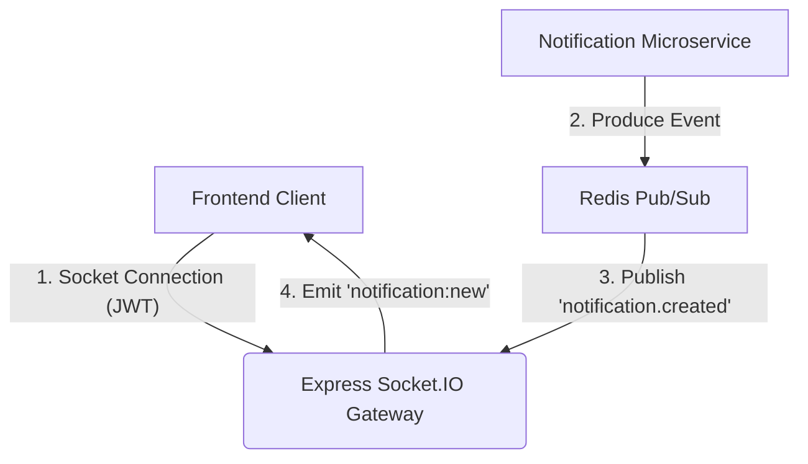

# AI Image Pipeline

An industry-grade, AI-powered media processing application featuring a decoupled microservices architecture. 

This project combines a modern React frontend, a robust Express backend with real-time Socket.IO notifications, an asynchronous three-stage AI Processing Worker (powered entirely by OpenAI), and a dedicated Email Notification system. 

It supports enterprise-grade patterns including JWT-based authentication, MongoDB data modeling, secure direct-to-cloud file uploads via Cloudflare R2, and reliable background job orchestration using BullMQ.

---

## 1. Quick Start

You can spin up the entire microservices architecture, including the database and message broker, using Docker Compose.

### Step 1: Setup Environment Variables

Before starting the containers, you must manually create a `.env` file in each service directory (`Express-Server`, `Worker System`, `Email System`, and `Frontend`). Ensure you configure your database URL, Redis host, and the necessary API keys as outlined below.

**Required API Keys:**

- **OpenAI API Key (Worker System)**: Sign in to the [OpenAI Platform](https://platform.openai.com/), navigate to API keys, create a new secret key, and save it as `OPENAI_API_KEY`.
- **Resend API Key (Email System)**: Sign in to the [Resend Dashboard](https://resend.com/), navigate to API Keys, create a new key, and save it as `RESEND_API_KEY`.
- **Cloudflare R2 Credentials (Express-Server & Worker System)**: Sign in to the [Cloudflare Dashboard](https://dash.cloudflare.com/), go to R2, create a bucket (`R2_BUCKET_NAME`), and manage R2 API tokens to get your `R2_ACCOUNT_ID`, `R2_ACCESS_KEY_ID`, and `R2_SECRET_ACCESS_KEY`.

### Step 2: Start the Application

Once the `.env` files are configured, build and run the services in detached mode:

```bash
docker compose up --build -d
```

### Step 3: Accessing the Services

After a successful startup, the services will be available at the following local endpoints:
- **Frontend**: [http://localhost:5173](http://localhost:5173)
- **Express Backend API**: [http://localhost:8000](http://localhost:8000)
- **MongoDB**: `localhost:27017`
- **Redis**: `localhost:6379`

### Stopping the Application

To safely shut down the containers without deleting your database and redis volumes:
```bash
docker compose down
```
To shut down and wipe all data volumes (useful for a clean reset):
```bash
docker compose down -v
```

---

## 2. Key Features

- **Decoupled AI Processing Pipeline**: A three-stage sequential background worker architecture utilizing **OpenAI (`gpt-4o-mini`)** for Image Captioning, Label Detection, and Safety Moderation.
- **Real-Time Notification Gateway**: Socket.IO integration pushes status updates directly to authenticated clients in real-time as background jobs progress.
- **Database-Free Microservices**: Both the AI Worker and Email System operate independently of the main database, coordinating exclusively via Redis queues (BullMQ) and events (`pipeline-events`).
- **Cloudflare R2 Integration**: Direct-to-R2 presigned file uploads securely transfer massive payloads without bottlenecking the backend server.
- **Robust Email System**: Standalone asynchronous email notification microservice built on BullMQ, Redis, and Resend with custom HTML templating.
- **Advanced Security & Authentication**: Production-ready JWT auth featuring Access/Refresh token rotation, secure HTTP-only cookies, password hashing (bcrypt), and Socket.IO handshake validation.
- **Memory & Storage Optimization**: Intelligent local caching (`/tmp` writes) in the worker system prevents redundant object storage downloads, managed by automated garbage-collection sweepers.

---

## 3. Architecture & Project Structure

The project is divided into four main independent services.

### Directory Layout

```text
├── Express-Server/          # Main REST API Backend & Socket.IO Gateway
│   ├── src/
│   │   ├── config.ts        # Environment configurations
│   │   ├── database/        # Mongoose schemas & connections
│   │   ├── features/        # Domain-driven feature modules (auth, jobs)
│   │   ├── shared/          # Middlewares, logging, global errors
│   │   └── index.ts         # Server entrypoint
│   └── api.md               # API endpoint documentation
│
├── Worker System/           # Standalone AI Processing Worker Microservice
│   ├── src/
│   │   ├── config/          # Zod-validated environment config
│   │   ├── modules/         # Sequential Pipeline Stages (W1, W2, W3)
│   │   └── worker.ts        # Worker orchestrator and cache sweeper
│   └── readme.md            # Worker architecture documentation
│
├── Email System/            # Standalone Notification Microservice
│   ├── src/
│   │   ├── features/        # Resend integrations & BullMQ processors
│   │   └── templates/       # Dynamic HTML/Text email templates
│   └── readme.md            # Notification system documentation
│
└── Frontend/                # React Vite SPA
    ├── src/
    │   ├── components/      # UI components (Tailwind)
    │   ├── pages/           # Application views
    │   └── lib/             # API client configurations
```

### Real-Time Notification Flow

The Main Backend hosts Socket.IO alongside its REST endpoints. When microservices (like the Worker or Email systems) publish updates to Redis, the Gateway forwards these events in real-time to authenticated clients.



**Connection Requirements**
- **Authentication**: A valid JWT must be passed in the connection handshake.
- **Private Rooms**: Authenticated connections join a private room (`user:<userId>`) to ensure secure message routing.

---

## 4. Tech Stack

### Frontend
- **Core**: React 19, TypeScript
- **Build & Bundle**: Vite
- **Styling**: Tailwind CSS, Framer Motion (Animations)
- **Forms & Validation**: React Hook Form, Zod
- **Icons**: Lucide React

### API Gateway (Express Backend)
- **Core**: Node.js, Express.js, TypeScript, Socket.IO
- **Database & ORM**: MongoDB, Mongoose
- **Queueing & Events**: Redis Pub/Sub (`ioredis`)
- **Storage**: Cloudflare R2 (S3-compatible) via AWS SDK v3
- **Security**: JWT, bcryptjs, Helmet, CORS, express-rate-limit
- **Observability**: Winston, Morgan

### AI Processing Worker
- **Core**: Node.js, TypeScript
- **Task Orchestration**: BullMQ & Redis
- **AI Engine**: OpenAI API (`gpt-4o-mini`)
- **Architecture**: Database-free, stateless, hybrid local caching

### Notification Service (Email Worker)
- **Core**: Node.js, TypeScript, Express.js
- **Task Orchestration**: BullMQ & Redis
- **Provider**: Resend SDK
- **Architecture**: Database-free, custom HTML template engine

---

## 5. Security Posture

- **Token Storage**: Refresh tokens are isolated in HTTP-only, secure cookies. Short-lived access tokens reside in memory.
- **Socket Handshake Verification**: Socket.IO connections actively reject connections lacking a valid, signed JWT access token.
- **Direct Upload Security**: Clients must request cryptographically signed URLs (time-limited) to interact with Cloudflare R2, ensuring malicious payloads bypass backend servers entirely.
- **Error Sanitization**: Global error handlers scrub stack traces before responses reach clients in production.

---

## 6. Service Documentation

For detailed information about each microservice, please refer to their respective README documentation:

- [Express-Server Documentation](Express-Server/readme.md)
- [Worker System Documentation](Worker%20System/readme.md)
- [Email System Documentation](Email%20System/readme.md)
- [Frontend Documentation](Frontend/readme.md)
